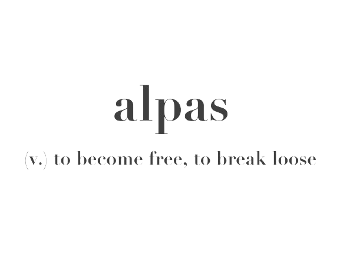

<a name="readme-top">

<br/>

<br />
<div align="center">
  <a href="https://github.com/zyx-0314/">
  <!-- TODO: If you want to add logo or banner you can add it here -->
    
  </a>
<!-- TODO: Change Title to the name of the title of your Project -->
  <h3 align="center">Features Page</h3>
</div>

<br />

<!-- TODO: Change the zyx-0314 into your github username  -->
<!-- TODO: Change the WD-Template-Project into the same name of your folder -->


---

<br />
<br />

<!-- TODO: If you want to add more layers for your readme -->
<details>
  <summary>Table of Contents</summary>
  <ol>
    <li>
      <a href="#overview">Overview</a>
      <ol>
        <li>
          <a href="#key-components">Key Components</a>
        </li>
        <li>
          <a href="#technology">Technology</a>
        </li>
      </ol>
    </li>
    <li>
      <a href="#rule,-practices-and-principles">Rules, Practices and Principles</a>
    </li>
    <li>
      <a href="#resources">Resources</a>
    </li>
  </ol>
</details>

---

## Overview

<!-- TODO: To be changed -->
<!-- The following are just sample -->
Description of the project in details. <br> <br>
The project involves creating a landing page and 2 feature pages. For this project I created a landing page that has a Jujutsu Kaisen theme. It consists of a header that contains navigation buttons and the JJK logo and a card containing the needed info for the project. 
The nav bar contains buttons that leads to the 2 features pages. The first feature page is Kyoto Jujutsu High page. The contents of the header is the same as the landing page as it is the same across all pages. Below the header is a hero image used as background. Below it is an about us section containing more details about Kyoto Jujutsu High. For the Sorceres page, you would see the same header from the landing page. You would also see an image slider containg images and info about the sorceres studying in Jujutsu High. I also added an animation for the content that would be displayed in each slide. For the icons used in the image slider buttons, I got it from the Font Awesome icons library. <br> <br>
For the landing page and jujutsu high page, I maximized the use of HTML and CSS. As for the sorceres page, since I have an image slider I added a JS file. As for the design, I made sure that the theme of Jujutsu Kaisen would be carried out across all pages. Some key parts is the red border for the buttons as well as the dark backgrounds in the pages. <br> <br>
Guiding Question: <br> <br>
<b>- What is the project: </b> This project is a website that contains a landing page that has a navigation bar that would lead you to other pages which contains the feature designs. <br>
<b>- Whats the purpose:</b> The purpose of this project is to enhance our HTML and CSS skills as well as to show our creativity in coming up with designs. <br>
<b>- What are key components:</b> The key components for this project is a landing page and 2 feature pages. <br>
<b>- What technology used and how it is used:</b> For this project I utilized the use of HTML, CSS, and JS. <br>

### Key Components
<!-- TODO: List of Key Components -->
<!-- The following are just sample -->
- MultiPage Website
- Landing Page
- 2 Feature Page

### Technology
<!-- TODO: List of Technology Used -->


## Rules, Practices and Principles
1. Always use `WD-` in the front of the Title of the Project for the Subject followed by your custom naming.
2. Do not rename any .html files; always use `index.html` as the filename.
3. Place Files in their respective folders.
4. All file naming are in camel case.
   - Camel case is naming format where there is no white space in separation of each words, the first word is in all lower case while the succeding words first letter are in upper followed by lower cased letters.
   - ex.: buttonAnimatedStyle.css
5. Use only `External CSS`.
6. Renaming of Pages folder names are a must, and relates to what it is doing or data it holding.
7. File Structure to follow below.

```
WD-ProjectName
└─ assets
|   └─ css
|   |   └─ style.css
|   └─ img
|   |   └─ fileWith.jpeg/.jpg/.webp/.png
|   └─ js
|       └─ script.js
└─ pages
|  └─ pageName
|     └─ assets
|     |  └─ css
|     |  |  └─ style.css
|     |  └─ img
|     |  |  └─ fileWith.jpeg/.jpg/.webp/.png
|     |  └─ js
|     |     └─ script.js
|     └─ index.html
└─ index.html
└─ readme.md
```

## Resources

<!-- TODO: Add References -->
| Title | Purpose | Link |
  |-|-|-|
| How to create an Image Slider in HTML CSS and JavaScript Step by Step Creative JS Coder. | I used this for my image slider in my Sorcerer page. | https://www.youtube.com/watch?v=OTjmnF27ADk&t=8s |
| Jiu Jutsu Kaisen Wiki | I used this for the facts that I put on my pages. | https://jujutsu-kaisen.fandom.com/wiki/Jujutsu_Sorcerer#2018 |
| Font Awesome | Used for the icons in the sorceres page | https://cdnjs.cloudflare.com/ajax/libs/font-awesome |

